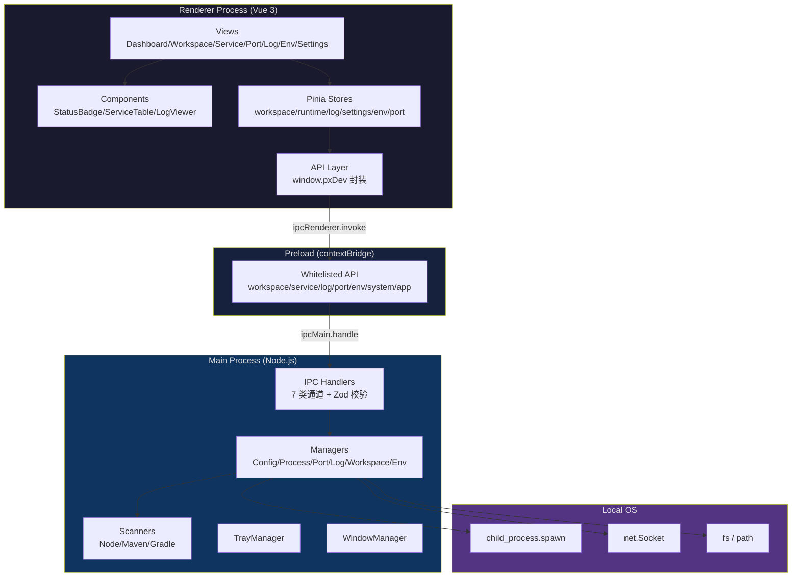
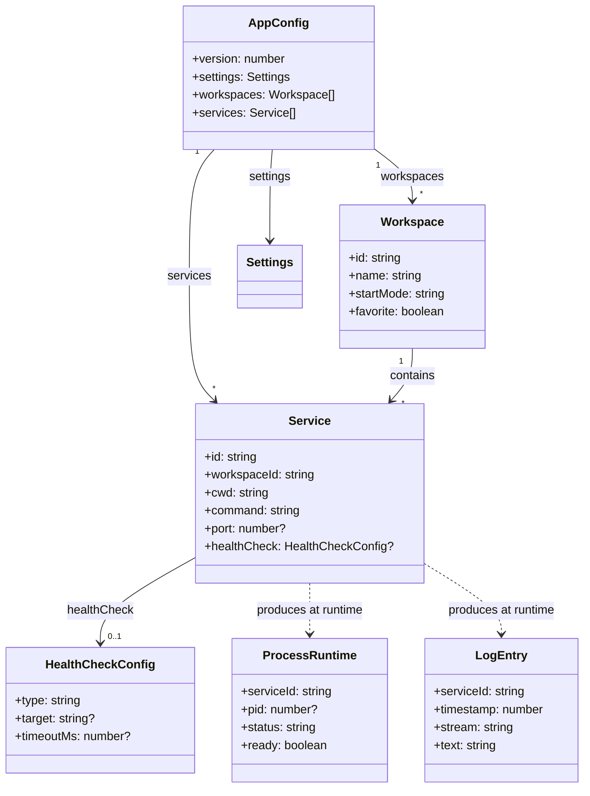
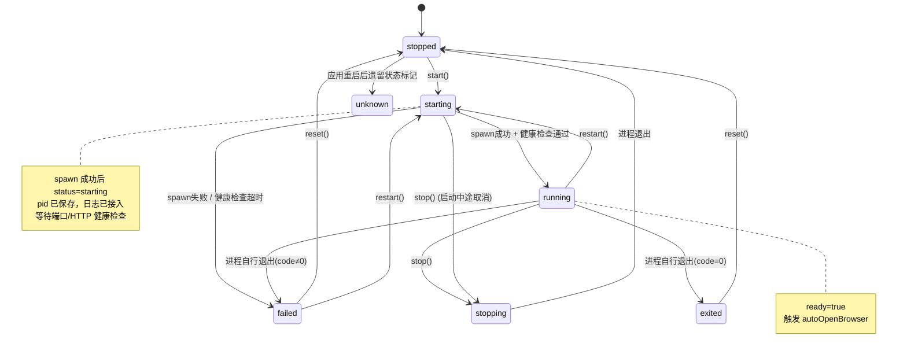
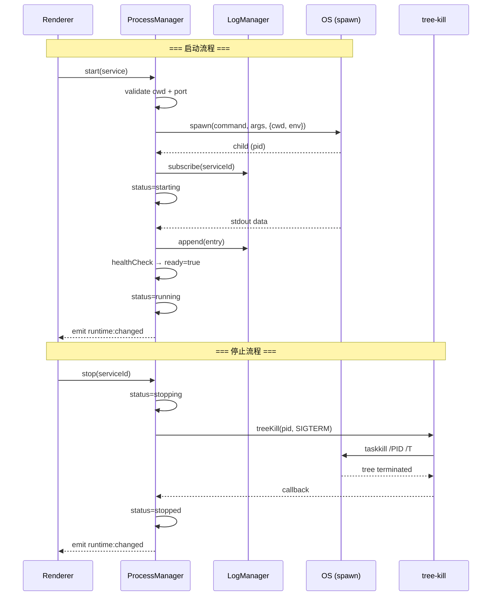
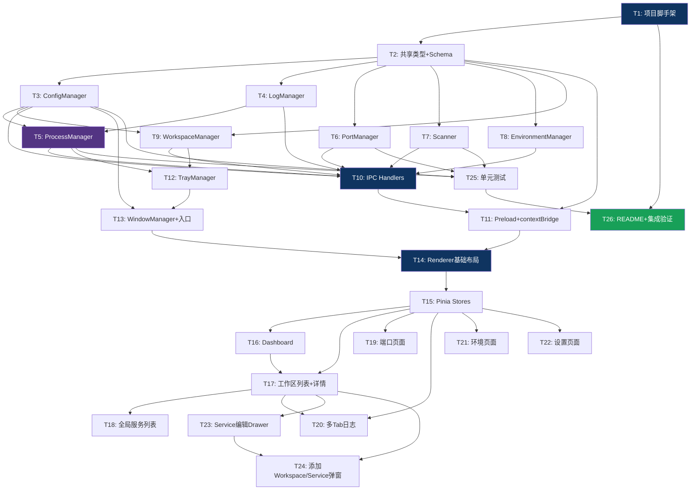

# PX Dev — 系统设计文档

> **项目**：PX Dev — 本地开发环境与项目进程管理工具  
> **版本**：V0.1（P0 全部 + P1 关键项）  
> **平台**：Windows 优先（架构不锁死 Windows）  
> **技术栈**：Electron + electron-vite + Vue 3 + TypeScript + Naive UI + Pinia + Zod + tree-kill + Vitest  
> **架构师**：Bob（高见远）

---

## 目录

- [Part A: 系统设计](#part-a-系统设计)
  - [1. 技术选型确认清单](#1-技术选型确认清单)
  - [2. 完整目录结构](#2-完整目录结构)
  - [3. 数据模型](#3-数据模型)
  - [4. IPC 契约](#4-ipc-契约)
  - [5. ProcessManager 状态机](#5-processmanager-状态机)
  - [6. 待明确事项](#6-待明确事项)
- [Part B: 任务分解](#part-b-任务分解)
  - [7. 依赖包清单](#7-依赖包清单)
  - [8. 任务列表](#8-任务列表)
  - [9. 共享知识（跨文件约定）](#9-共享知识跨文件约定)
  - [10. 任务依赖图](#10-任务依赖图)

---

# Part A: 系统设计

## 1. 技术选型确认清单

### 1.1 默认技术栈验证

| 技术 | 用途 | 验证结论 |
|------|------|---------|
| **Electron** | 桌面壳 + Main Process 系统能力 | ✅ Node child_process 原生适配，Windows 生态成熟 |
| **electron-vite** | 构建 + 热重载（Main/Preload/Renderer 三段） | ✅ Electron 官方推荐 Vite 方案，TS 开箱即用 |
| **Vue 3** | Renderer UI | ✅ 组合式 API 适配状态管理，生态完整 |
| **Pinia** | Renderer 状态管理 | ✅ 轻量、TS 友好；**注意：runtimeStore 仅作 Main 镜像，非唯一事实源** |
| **Naive UI** | 组件库 | ✅ 深色主题原生支持，DataTable/Tabs/Drawer/Form 齐全 |
| **Zod** | IPC 参数 + 配置 schema 校验 | ✅ 运行时校验 + TS 类型推导一体 |
| **tree-kill** | 跨平台进程树终止 | ✅ Windows 调用 `taskkill /T`，成熟稳定 |
| **Vitest** | 单元测试 | ✅ Vite 原生集成，速度快 |

### 1.2 确切依赖包列表

#### dependencies（运行时，Main Process 依赖）

```json
{
  "tree-kill": "^1.2.2",
  "zod": "^3.23.8"
}
```

> **说明**：`tree-kill` 和 `zod` 在 Main Process 中被直接 `require`，放入 dependencies 以确保打包后可解析。其余 Vue/Naive UI/Pinia 等渲染层依赖由 electron-vite 打包进 renderer bundle，放在 devDependencies。

#### devDependencies（构建时 + 渲染层）

```json
{
  "electron": "^31.1.0",
  "electron-vite": "^2.3.0",
  "electron-builder": "^24.13.3",

  "vue": "^3.4.31",
  "vue-router": "^4.4.0",
  "pinia": "^2.1.7",
  "naive-ui": "^2.38.1",
  "@vicons/ionicons5": "^0.12.0",

  "typescript": "^5.5.3",
  "vite": "^5.3.3",
  "@vitejs/plugin-vue": "^5.0.5",
  "vue-tsc": "^2.0.26",

  "vitest": "^2.0.3",
  "@vue/test-utils": "^2.4.6",

  "sass": "^1.77.6",
  "@types/node": "^20.14.9",

  "eslint": "^8.57.0",
  "@typescript-eslint/eslint-plugin": "^7.13.0",
  "@typescript-eslint/parser": "^7.13.0",
  "eslint-plugin-vue": "^9.27.0",
  "@vue/eslint-config-typescript": "^13.0.0"
}
```

### 1.3 关键决策点

| 决策点 | 选择 | 理由 |
|--------|------|------|
| **日志流式策略** | Main 每 **80ms** 批量 flush，发送 `log:batch` 事件携带 `LogEntry[]` | 文档 §39 要求 50~100ms 批量；80ms 居中，平衡实时性与渲染性能 |
| **端口检测** | `net.Socket` 尝试 TCP 连接（非 `net.createServer`） | `createServer` 会临时占用端口；`Socket` 连接更轻量、不干扰目标端口 |
| **端口占用者识别** | Windows: `netstat -ano` + `tasklist` 解析 | V0.1 不引入 `ps-list` 等额外依赖，用系统命令 |
| **进程树终止** | `tree-kill(pid, 'SIGTERM')` | Windows 底层调用 `taskkill /PID xxx /T /F`；成熟跨平台 |
| **命令执行** | **structured 优先**（拆 `executable` + `args`），`shellMode` 可选 | 文档 §13 要求；structured 避免注入风险，Windows 自动处理 `npm.cmd` |
| **Windows 命令解析** | 检测 `npm` → 补 `.cmd`；`pnpm` → 补 `.CMD` | Node `spawn` 在 Windows 不会自动追加 `.cmd`（`shell:false` 时） |
| **配置原子写入** | `config.json.tmp` → `fs.writeFileSync` → `fs.renameSync` → 同步备份 `.bak` | 文档 §11 要求；rename 是原子操作，防止崩溃损坏 |
| **UUID 生成** | `crypto.randomUUID()`（Node 内置） | 无需额外依赖，Electron Main 可用 |
| **虚拟列表** | 自实现简易虚拟滚动（固定行高 + `transform`） | V0.1 不引入 `vue-virtual-scroller`，减少依赖；Naive UI 无原生虚拟列表 |
| **ANSI 颜色** | `strip-ansi` 仅用于搜索/导出；渲染时用正则转 `<span>` | 减少依赖；V0.1 日志以纯文本为主，ANSI 解析为 P2 |
| **contextIsolation** | `true`（强制） | 文档 §24 安全要求 |
| **nodeIntegration** | `false`（强制） | 文档 §24 安全要求 |

---

## 2. 完整目录结构

```
px-dev/
├─ .github/
│  └─ workflows/
│     └─ build.yml                        # CI（预留，V0.1 可空）
│
├─ build/
│  └─ icon.ico                            # 应用图标
│
├─ resources/
│  └─ tray-icon.png                       # 托盘图标（16x16 / 32x32）
│
├─ src/
│  ├─ main/
│  │  ├─ index.ts                         # ★ Main 入口：app 生命周期 + 窗口创建 + IPC 注册
│  │  ├─ ipc/
│  │  │  ├─ index.ts                      # registerAllHandlers() 汇总注册
│  │  │  ├─ workspace.ipc.ts              # workspace:list/create/update/delete
│  │  │  ├─ service.ipc.ts               # service:list/create/update/delete/start/stop/restart/runtime
│  │  │  ├─ log.ipc.ts                    # log:subscribe/unsubscribe/clear/history/export
│  │  │  ├─ environment.ipc.ts            # environment:detect
│  │  │  ├─ port.ipc.ts                   # port:check/owner/kill/waitListening
│  │  │  ├─ system.ipc.ts                 # system:openPath/openExternal/selectDirectory/scanDirectory
│  │  │  └─ app.ipc.ts                    # app:getSettings/updateSettings/getConfig/quit/minimize
│  │  ├─ managers/
│  │  │  ├─ ConfigManager.ts              # JSON load/save/backup/migrate/recover
│  │  │  ├─ ProcessManager.ts             # spawn/stop/restart/forceKill/状态机/日志接入
│  │  │  ├─ LogManager.ts                 # Ring Buffer + 80ms 批量 flush
│  │  │  ├─ PortManager.ts                # net.Socket 检测 + waitUntilListening + getOwner
│  │  │  ├─ WorkspaceManager.ts           # Workspace CRUD + Service CRUD + 校验
│  │  │  └─ EnvironmentManager.ts         # node/npm/pnpm/yarn/java/mvn/gradle/git 版本检测
│  │  ├─ scanners/
│  │  │  ├─ index.ts                      # ScannerRegistry：扫描分发
│  │  │  ├─ NodeProjectScanner.ts         # package.json + lock 文件 + scripts 识别
│  │  │  ├─ MavenProjectScanner.ts        # pom.xml + mvnw 识别
│  │  │  └─ GradleProjectScanner.ts       # build.gradle(.kts) + gradlew 识别
│  │  ├─ tray/
│  │  │  └─ TrayManager.ts               # 系统托盘菜单 + 运行中服务展示 + 退出策略
│  │  ├─ window/
│  │  │  └─ WindowManager.ts             # BrowserWindow 创建/显示/隐藏 + 关闭策略弹窗
│  │  └─ utils/
│  │     ├─ logger.ts                     # Main 进程日志（console + 可选文件）
│  │     ├─ paths.ts                      # 路径工具：userData / configPath / bakPath
│  │     ├─ command.ts                    # 命令解析：structured 拆分 + Windows .cmd 补全
│  │     └─ health.ts                     # 健康检查执行器（port check / http check）
│  │
│  ├─ preload/
│  │  ├─ index.ts                         # contextBridge.exposeInMainWorld('pxDev', api)
│  │  └─ api.ts                           # 白名单 API 对象（按 domain 分组）
│  │
│  └─ renderer/
│     ├─ index.html                       # HTML 入口
│     └─ src/
│        ├─ main.ts                       # ★ Renderer 入口：createApp + Pinia + Router + Naive UI
│        ├─ App.vue                       # 根组件（NConfigProvider + NMessageProvider + RouterView）
│        ├─ api/
│        │  ├─ index.ts                   # 类型安全封装：调用 window.pxDev.*
│        │  └─ events.ts                  # IPC 事件监听辅助（onRuntimeChanged / onLogBatch）
│        ├─ components/
│        │  ├─ StatusBadge.vue            # 服务状态彩色标签（5 色）
│        │  ├─ ServiceTable.vue           # 服务数据表格（名称/类型/端口/状态/PID/运行时长/操作）
│        │  ├─ LogViewer.vue              # 日志查看器（虚拟滚动 + 自动滚动 + 暂停）
│        │  ├─ StatCard.vue               # Dashboard 统计卡片
│        │  ├─ EmptyState.vue             # 空状态占位
│        │  └─ ConfirmDialog.vue          # 确认弹窗（端口冲突/退出/强制停止）
│        ├─ composables/
│        │  ├─ useService.ts              # 服务操作组合式函数
│        │  └─ useLogStream.ts            # 日志订阅/取消订阅组合式函数
│        ├─ layouts/
│        │  └─ MainLayout.vue            # 深色侧边栏 + 内容区 NLayout
│        ├─ router/
│        │  └─ index.ts                   # Vue Router 路由表（8 个路由）
│        ├─ stores/
│        │  ├─ workspaceStore.ts          # 工作区 + 服务列表（CRUD 调用 IPC）
│        │  ├─ runtimeStore.ts            # 进程运行时镜像（Main 事件驱动同步）
│        │  ├─ logStore.ts                # 每服务日志缓冲（batch append）
│        │  ├─ settingsStore.ts           # 设置读写
│        │  ├─ environmentStore.ts        # 环境检测结果
│        │  └─ portStore.ts              # 端口信息
│        ├─ styles/
│        │  ├─ variables.scss             # 主题变量 + 状态色
│        │  └─ global.scss               # 全局样式 + 滚动条
│        ├─ types/
│        │  └─ index.ts                   # Renderer 专用类型（PxDevAPI 接口等）
│        └─ views/
│           ├─ DashboardView.vue          # 首页：统计卡片 + 最近工作区 + 快捷操作
│           ├─ WorkspacesView.vue         # 工作区列表（卡片/表格）
│           ├─ WorkspaceDetailView.vue    # 工作区详情：操作栏 + ServiceTable
│           ├─ ServicesView.vue           # 全局服务列表
│           ├─ PortsView.vue              # 端口管理面板
│           ├─ LogsView.vue              # 多 Tab 日志页面
│           ├─ EnvironmentView.vue        # 环境检测表格
│           └─ SettingsView.vue           # 设置页面
│
├─ shared/
│  ├─ schemas/
│  │  ├─ workspace.schema.ts              # WorkspaceSchema (Zod)
│  │  ├─ service.schema.ts               # ServiceSchema (Zod)
│  │  ├─ config.schema.ts                # AppConfigSchema (Zod)
│  │  ├─ ipc.schema.ts                   # 所有 IPC 请求 schema（按通道）
│  │  └─ index.ts                         # re-export
│  ├─ types/
│  │  ├─ index.ts                         # 所有 TS 接口（Workspace/Service/LogEntry 等）
│  │  └─ ipc.ts                           # IPC 通道名常量类型 + 响应类型
│  └─ constants/
│     ├─ status.ts                        # 状态枚举 + 颜色映射 + 中文标签
│     ├─ ipc-channels.ts                  # 所有 IPC channel 名字符串常量
│     └─ defaults.ts                      # 默认 AppConfig / Settings
│
├─ tests/
│  ├─ ConfigManager.test.ts               # 首次启动/正常保存/JSON损坏/备份恢复/迁移
│  ├─ ProcessManager.test.ts              # spawn/stdout/stderr/退出/stop/restart/forceKill
│  ├─ Scanner.test.ts                     # npm/pnpm/yarn/Maven/Gradle/未识别
│  └─ PortManager.test.ts                 # 空闲/占用/等待监听/超时
│
├─ electron-builder.yml                   # 打包配置（NSIS）
├─ electron.vite.config.ts                # electron-vite 构建配置
├─ package.json
├─ tsconfig.json                          # 根 tsconfig（references）
├─ tsconfig.node.json                     # Main + Preload + shared 的 TS 配置
├─ tsconfig.web.json                      # Renderer 的 TS 配置
├─ vitest.config.ts                       # Vitest 配置
├─ .eslintrc.cjs                          # ESLint 配置
├─ .gitignore
└─ README.md
```

### 架构分层图



---

## 3. 数据模型

> 所有接口定义在 `shared/types/index.ts`，Zod schema 定义在 `shared/schemas/`，二者保持同步。

### 3.1 核心实体（文档 §10 精确化）

```ts
// ============ Workspace ============
interface Workspace {
  id: string                  // crypto.randomUUID()
  name: string                // 非空
  description?: string
  rootPath?: string           // 工作区根目录（可选）
  color?: string              // hex 颜色，用于卡片标识
  icon?: string               // 图标名（@vicons）
  favorite: boolean           // 是否收藏
  startMode: 'parallel' | 'sequential' | 'dependency'
  createdAt: string           // ISO 8601 UTC
  updatedAt: string           // ISO 8601 UTC
}

// ============ Service ============
interface Service {
  id: string                  // crypto.randomUUID()
  workspaceId: string         // 关联 Workspace.id
  name: string                // 非空
  type: 'frontend' | 'node' | 'java' | 'generic'
  cwd: string                 // 工作目录（绝对路径，非空）
  command: string             // 可执行命令（如 'npm' / 'pnpm' / 'mvnw'）
  args?: string[]             // 参数数组（如 ['run', 'dev']）
  packageManager?: 'npm' | 'pnpm' | 'yarn' | 'bun' | 'custom'
  port?: number               // 1-65535
  env?: Record<string, string>  // 环境变量
  envFile?: string            // .env 文件路径
  enabled: boolean            // 是否参与一键启动
  dependencies: string[]      // 依赖的其他 Service.id
  startupDelay?: number       // 启动延迟（ms）
  autoOpenBrowser?: boolean   // 就绪后自动打开浏览器
  openUrl?: string            // 打开的 URL
  healthCheck?: HealthCheckConfig
  shellMode?: boolean         // 是否用 shell:true（默认 false）
  createdAt: string           // ISO 8601 UTC
  updatedAt: string           // ISO 8601 UTC
}

// ============ HealthCheckConfig ============
interface HealthCheckConfig {
  type: 'none' | 'port' | 'http'
  target?: string             // port 模式: 端口号; http 模式: URL
  timeoutMs?: number          // 单次检查超时，默认 5000
  intervalMs?: number         // 检查间隔，默认 2000
  retries?: number            // 重试次数，默认 10
}

// ============ ProcessRuntime（仅运行期） ============
interface ProcessRuntime {
  serviceId: string
  pid?: number
  status: 'stopped' | 'starting' | 'running' | 'stopping' | 'exited' | 'failed' | 'unknown'
  ready: boolean               // 健康检查通过 = true
  startedAt?: number           // Date.now() 时间戳
  stoppedAt?: number
  exitCode?: number | null
  error?: string               // 错误信息
}
```

### 3.2 辅助数据模型（文档未明确但必需）

```ts
// ============ LogEntry（文档 §16） ============
interface LogEntry {
  serviceId: string
  timestamp: number            // Date.now()
  stream: 'stdout' | 'stderr'
  text: string                 // 单行或多行文本
}

// ============ AppConfig（文档 §11 配置结构） ============
interface AppConfig {
  version: number              // schema 版本号，当前 = 1
  settings: Settings
  workspaces: Workspace[]
  services: Service[]
}

// ============ Settings（文档 §13 全局设置） ============
interface Settings {
  theme: 'light' | 'dark' | 'system'
  closeBehavior: 'tray' | 'quit' | 'ask'
  maxLogLines: number          // 默认 5000
  startMinimized: boolean      // 启动后最小化到托盘
  autoRestoreLastSession: boolean  // 启动后恢复上次运行工作区
  startupInterval: number      // 服务启动间隔（ms），默认 1000
  showTimestamp: boolean       // 日志显示时间戳
  defaultBrowser: string       // 'system' 或浏览器 exe 路径
}

// ============ EnvironmentInfo（文档 §31） ============
interface EnvironmentInfo {
  name: string                 // 'node' | 'npm' | 'pnpm' | 'yarn' | 'java' | 'mvn' | 'gradle' | 'git'
  available: boolean
  version: string              // 如 'v24.0.0'
  path: string                 // 可执行文件路径
  error?: string               // 不可用时的错误信息
}

// ============ PortOwner（文档 §17） ============
interface PortOwner {
  port: number
  pid: number
  name: string                 // 进程名（如 'node.exe'）
}

// ============ ScanResult（文档 §19-21） ============
interface ScanResult {
  path: string                 // 扫描目录
  type: 'node' | 'maven' | 'gradle' | 'unknown'
  packageManager?: string      // 'npm' | 'pnpm' | 'yarn'
  recommendedCommand: string   // 如 'pnpm'
  recommendedArgs: string[]    // 如 ['dev']
  scripts?: Record<string, string>  // package.json scripts
  detectedPort?: number        // 从 vite.config / application.properties 推断
}

// ============ ManagedProcess（ProcessManager 内部） ============
interface ManagedProcess {
  child: import('child_process').ChildProcess
  runtime: ProcessRuntime
}

// ============ IPC 统一响应格式（超出 P0 但必需） ============
interface IpcResponse<T = unknown> {
  success: boolean
  data?: T
  error?: {
    code: string               // 如 'PORT_CONFLICT' / 'CWD_NOT_FOUND' / 'VALIDATION_ERROR'
    message: string
  }
}
```

### 3.3 数据模型关系图

> 完整 classDiagram 见 `docs/class-diagram.mermaid`



---

## 4. IPC 契约

> **安全原则**（文档 §24/§25）：所有 `ipcMain.handle` 入参经 Zod 校验；Preload 仅暴露白名单 API；`contextIsolation: true`，`nodeIntegration: false`。  
> **命名规范**：`domain:action`，全小写，冒号分隔。  
> **响应格式**：成功返回 `data`，失败 `throw Error`（IPC 自动转为 rejection），错误对象含 `{ code, message }`。

### 4.1 通道总览

| 域 | 通道 | 方向 | 说明 |
|----|------|------|------|
| workspace | `workspace:list` | R→M | 列出所有工作区 |
| workspace | `workspace:create` | R→M | 创建工作区 |
| workspace | `workspace:update` | R→M | 更新工作区 |
| workspace | `workspace:delete` | R→M | 删除工作区 |
| service | `service:list` | R→M | 列出服务（可按 workspaceId 过滤） |
| service | `service:create` | R→M | 创建服务 |
| service | `service:update` | R→M | 更新服务 |
| service | `service:delete` | R→M | 删除服务 |
| service | `service:start` | R→M | 启动单个服务 |
| service | `service:stop` | R→M | 停止单个服务（进程树） |
| service | `service:restart` | R→M | 重启服务 |
| service | `service:forceKill` | R→M | 强制终止 |
| service | `service:runtime` | R→M | 查询运行时状态 |
| service | `service:startWorkspace` | R→M | 一键启动工作区全部服务 |
| service | `service:stopWorkspace` | R→M | 一键停止工作区全部服务 |
| service | `service:stopAll` | R→M | 停止所有运行中服务 |
| log | `log:subscribe` | R→M | 订阅服务日志 |
| log | `log:unsubscribe` | R→M | 取消订阅 |
| log | `log:clear` | R→M | 清空日志缓冲 |
| log | `log:history` | R→M | 获取历史日志 |
| log | `log:export` | R→M | 导出日志到文件 |
| log | `log:batch` | M→R | **事件**：批量日志推送（80ms） |
| environment | `environment:detect` | R→M | 检测全部环境 |
| environment | `environment:detectSingle` | R→M | 检测单个环境 |
| port | `port:check` | R→M | 检测端口是否可用 |
| port | `port:owner` | R→M | 查询端口占用者 |
| port | `port:kill` | R→M | 终止占用进程（需用户确认） |
| port | `port:waitListening` | R→M | 等待端口监听 |
| system | `system:openPath` | R→M | 在文件管理器中打开目录 |
| system | `system:openExternal` | R→M | 用浏览器打开 URL |
| system | `system:selectDirectory` | R→M | 弹出目录选择对话框 |
| system | `system:scanDirectory` | R→M | 扫描目录自动识别项目 |
| system | `system:showItemInFolder` | R→M | 在文件管理器中定位文件 |
| app | `app:getSettings` | R→M | 获取设置 |
| app | `app:updateSettings` | R→M | 更新设置 |
| app | `app:getVersion` | R→M | 获取应用版本 |
| app | `app:quit` | R→M | 退出应用 |
| app | `app:minimize` | R→M | 最小化到托盘 |
| — | `service:runtime:changed` | M→R | **事件**：运行时状态变更通知 |

### 4.2 Zod Schema 定义（`shared/schemas/ipc.schema.ts`）

```ts
import { z } from 'zod'

// ===== 通用 =====
const uuidSchema = z.string().min(1)           // 宽松：V0.1 用 crypto.randomUUID()，但不强制 uuid 格式校验
const pathSchema = z.string().min(1)            // 路径非空
const portSchema = z.number().int().min(1).max(65535)

// ===== Workspace =====
export const ListWorkspacesSchema = z.object({}).optional()

export const CreateWorkspaceSchema = z.object({
  name: z.string().min(1).max(100),
  description: z.string().max(500).optional(),
  rootPath: pathSchema.optional(),
  color: z.string().regex(/^#[0-9a-fA-F]{6}$/).optional(),
  icon: z.string().optional(),
  favorite: z.boolean().default(false),
  startMode: z.enum(['parallel', 'sequential', 'dependency']).default('parallel'),
})

export const UpdateWorkspaceSchema = z.object({
  id: uuidSchema,
  name: z.string().min(1).max(100).optional(),
  description: z.string().max(500).optional(),
  rootPath: pathSchema.optional(),
  color: z.string().regex(/^#[0-9a-fA-F]{6}$/).optional(),
  icon: z.string().optional(),
  favorite: z.boolean().optional(),
  startMode: z.enum(['parallel', 'sequential', 'dependency']).optional(),
})

export const DeleteWorkspaceSchema = z.object({
  id: uuidSchema,
})

// ===== Service =====
export const ListServicesSchema = z.object({
  workspaceId: uuidSchema.optional(),
})

export const CreateServiceSchema = z.object({
  workspaceId: uuidSchema,
  name: z.string().min(1).max(100),
  type: z.enum(['frontend', 'node', 'java', 'generic']),
  cwd: pathSchema,
  command: z.string().min(1),
  args: z.array(z.string()).optional(),
  packageManager: z.enum(['npm', 'pnpm', 'yarn', 'bun', 'custom']).optional(),
  port: portSchema.optional(),
  env: z.record(z.string(), z.string()).optional(),
  envFile: pathSchema.optional(),
  enabled: z.boolean().default(true),
  dependencies: z.array(uuidSchema).default([]),
  startupDelay: z.number().int().min(0).max(60000).optional(),
  autoOpenBrowser: z.boolean().optional(),
  openUrl: z.string().url().optional(),
  healthCheck: z.object({
    type: z.enum(['none', 'port', 'http']),
    target: z.string().optional(),
    timeoutMs: z.number().int().min(100).max(60000).optional(),
    intervalMs: z.number().int().min(500).max(60000).optional(),
    retries: z.number().int().min(0).max(100).optional(),
  }).optional(),
  shellMode: z.boolean().default(false),
})

export const UpdateServiceSchema = CreateServiceSchema.partial().extend({
  id: uuidSchema,
})

export const DeleteServiceSchema = z.object({ id: uuidSchema })

// ===== Service 操作 =====
export const StartServiceSchema = z.object({ serviceId: uuidSchema })
export const StopServiceSchema = z.object({ serviceId: uuidSchema })
export const RestartServiceSchema = z.object({ serviceId: uuidSchema })
export const ForceKillServiceSchema = z.object({ serviceId: uuidSchema })
export const GetRuntimeSchema = z.object({ serviceId: uuidSchema.optional() })
export const StartWorkspaceSchema = z.object({ workspaceId: uuidSchema })
export const StopWorkspaceSchema = z.object({ workspaceId: uuidSchema })

// ===== Log =====
export const LogSubscribeSchema = z.object({ serviceId: uuidSchema })
export const LogUnsubscribeSchema = z.object({ serviceId: uuidSchema })
export const LogClearSchema = z.object({ serviceId: uuidSchema })
export const LogHistorySchema = z.object({
  serviceId: uuidSchema,
  limit: z.number().int().min(1).max(10000).optional(),
})
export const LogExportSchema = z.object({
  serviceId: uuidSchema,
  savePath: pathSchema.optional(),  // 不传则弹出保存对话框
})

// log:batch 事件 payload（M→R）
export const LogBatchEventSchema = z.object({
  serviceId: uuidSchema,
  entries: z.array(z.object({
    serviceId: uuidSchema,
    timestamp: z.number(),
    stream: z.enum(['stdout', 'stderr']),
    text: z.string(),
  })),
})

// ===== Environment =====
export const EnvironmentDetectSchema = z.object({}).optional()
export const EnvironmentDetectSingleSchema = z.object({
  name: z.enum(['node', 'npm', 'pnpm', 'yarn', 'java', 'mvn', 'gradle', 'git']),
})

// ===== Port =====
export const PortCheckSchema = z.object({ port: portSchema })
export const PortOwnerSchema = z.object({ port: portSchema })
export const PortKillSchema = z.object({ pid: z.number().int().positive() })
export const PortWaitListeningSchema = z.object({
  port: portSchema,
  timeoutMs: z.number().int().min(1000).max(120000).default(30000),
})

// ===== System =====
export const SystemOpenPathSchema = z.object({ path: pathSchema })
export const SystemOpenExternalSchema = z.object({ url: z.string().url() })
export const SystemSelectDirectorySchema = z.object({}).optional()
export const SystemScanDirectorySchema = z.object({ path: pathSchema })
export const SystemShowItemSchema = z.object({ path: pathSchema })

// ===== App =====
export const AppGetSettingsSchema = z.object({}).optional()
export const AppUpdateSettingsSchema = z.object({
  theme: z.enum(['light', 'dark', 'system']).optional(),
  closeBehavior: z.enum(['tray', 'quit', 'ask']).optional(),
  maxLogLines: z.number().int().min(500).max(50000).optional(),
  startMinimized: z.boolean().optional(),
  autoRestoreLastSession: z.boolean().optional(),
  startupInterval: z.number().int().min(0).max(30000).optional(),
  showTimestamp: z.boolean().optional(),
  defaultBrowser: z.string().optional(),
})
export const AppQuitSchema = z.object({}).optional()
export const AppMinimizeSchema = z.object({}).optional()
```

### 4.3 事件流（M→R）

| 事件通道 | 触发时机 | Payload |
|---------|---------|---------|
| `service:runtime:changed` | ProcessManager 状态转换时 | `{ serviceId: string, runtime: ProcessRuntime }` |
| `log:batch` | LogManager 每 80ms flush 时 | `{ serviceId: string, entries: LogEntry[] }` |

> **注意**：事件通过 `webContents.send()` 推送。Renderer 在 `logStore` / `runtimeStore` 中监听并批量更新，避免高频重绘。

---

## 5. ProcessManager 状态机

### 5.1 状态定义（文档 §15）

```ts
type ProcessStatus =
  | 'stopped'    // 灰 #909399 — 未运行
  | 'starting'   // 蓝 #2080F0 — 正在启动（spawn 成功，等待就绪）
  | 'running'    // 绿 #18A058 — 进程运行 + 健康检查通过
  | 'stopping'   // 橙 #F0A020 — 正在停止（tree-kill 中）
  | 'exited'     // 灰 #909399 — 进程正常退出（exit code 0）
  | 'failed'     // 红 #D03050 — 启动失败 / 进程异常退出
  | 'unknown'    // 灰 #909399 — 应用重启后无法确认的遗留状态
```

### 5.2 状态转换图



### 5.3 状态转换函数（TS pseudo-code）

```ts
// ProcessManager 内部方法

/** 合法状态转换映射 */
const VALID_TRANSITIONS: Record<ProcessStatus, ProcessStatus[]> = {
  stopped:   ['starting', 'unknown'],
  starting:  ['running', 'failed', 'stopping'],
  running:   ['stopping', 'exited', 'failed', 'starting'],
  stopping:  ['stopped'],
  exited:    ['stopped', 'starting'],
  failed:    ['stopped', 'starting'],
  unknown:   ['stopped', 'starting'],
}

function transition(serviceId: string, newStatus: ProcessStatus): void {
  const managed = this.processes.get(serviceId)
  if (!managed) throw new Error(`No process for service ${serviceId}`)

  const oldStatus = managed.runtime.status
  const allowed = VALID_TRANSITIONS[oldStatus]

  if (!allowed.includes(newStatus)) {
    // 非法转换：记录警告但不崩溃（进程事件可能乱序）
    logger.warn(`Invalid transition: ${oldStatus} → ${newStatus} for ${serviceId}`)
    return
  }

  managed.runtime.status = newStatus

  // 副作用
  if (newStatus === 'running') {
    managed.runtime.ready = true
  }
  if (newStatus === 'stopped' || newStatus === 'exited' || newStatus === 'failed') {
    managed.runtime.ready = false
    managed.runtime.stoppedAt = Date.now()
  }

  // 通知 Renderer
  this.emitRuntimeChanged(serviceId, managed.runtime)
}

/** 启动流程 */
async function start(service: Service): Promise<ProcessRuntime> {
  // 1. 校验 cwd
  if (!fs.existsSync(service.cwd)) {
    throw { code: 'CWD_NOT_FOUND', message: `目录不存在: ${service.cwd}` }
  }

  // 2. 端口预检
  if (service.port) {
    const available = await this.portManager.isAvailable(service.port)
    if (!available) {
      const owner = await this.portManager.getOwner(service.port)
      throw {
        code: 'PORT_CONFLICT',
        message: `端口 ${service.port} 已被 PID ${owner?.pid} (${owner?.name}) 占用`,
      }
    }
  }

  // 3. 构建 spawn 选项
  const { executable, args, options } = buildCommand(service)
  //    - structured 模式: command + args + Windows .cmd 补全
  //    - shell 模式: shell:true, command 作为完整字符串

  // 4. 状态 → starting
  const runtime: ProcessRuntime = {
    serviceId: service.id,
    status: 'starting',
    ready: false,
    startedAt: Date.now(),
  }
  const managed: ManagedProcess = { child: null!, runtime }
  this.processes.set(service.id, managed)
  this.transition(service.id, 'starting')

  // 5. spawn
  const child = spawn(executable, args, {
    cwd: service.cwd,
    env: { ...process.env, ...service.env },
    shell: service.shellMode ?? false,
    windowsHide: true,
  })
  managed.child = child
  managed.runtime.pid = child.pid

  // 6. 接入日志
  this.logManager.subscribe(service.id)
  child.stdout?.on('data', (chunk) => {
    this.logManager.append(service.id, {
      serviceId: service.id,
      timestamp: Date.now(),
      stream: 'stdout',
      text: chunk.toString(),
    })
  })
  child.stderr?.on('data', (chunk) => {
    this.logManager.append(service.id, {
      serviceId: service.id,
      timestamp: Date.now(),
      stream: 'stderr',
      text: chunk.toString(),
    })
  })

  // 7. 错误事件
  child.on('error', (err) => {
    managed.runtime.error = err.message
    this.transition(service.id, 'failed')
  })

  // 8. 退出事件
  child.on('exit', (code, signal) => {
    managed.runtime.exitCode = code
    if (managed.runtime.status === 'stopping') {
      this.transition(service.id, 'stopped')
    } else if (code === 0) {
      this.transition(service.id, 'exited')
    } else {
      this.transition(service.id, 'failed')
    }
  })

  // 9. 健康检查 → running
  if (service.healthCheck?.type && service.healthCheck.type !== 'none') {
    const healthy = await this.runHealthCheck(service)
    if (healthy && managed.runtime.status === 'starting') {
      this.transition(service.id, 'running')
      // 10. 自动打开浏览器
      if (service.autoOpenBrowser && service.openUrl) {
        shell.openExternal(service.openUrl)
      }
    }
  } else {
    // 无健康检查：spawn 成功即 running
    this.transition(service.id, 'running')
    if (service.autoOpenBrowser && service.openUrl) {
      shell.openExternal(service.openUrl)
    }
  }

  return managed.runtime
}

/** 停止流程（进程树终止） */
async function stop(serviceId: string): Promise<ProcessRuntime> {
  const managed = this.processes.get(serviceId)
  if (!managed || !managed.child) {
    return { serviceId, status: 'stopped', ready: false }
  }

  this.transition(serviceId, 'stopping')

  return new Promise((resolve) => {
    const pid = managed.child.pid!
    treeKill(pid, 'SIGTERM', (err) => {
      if (err) {
        // SIGTERM 失败，尝试 SIGKILL
        treeKill(pid, 'SIGKILL', () => {
          this.transition(serviceId, 'stopped')
          resolve(managed.runtime)
        })
      } else {
        this.transition(serviceId, 'stopped')
        resolve(managed.runtime)
      }
    })
  })
}
```

### 5.4 关键时序图

> 完整时序图见 `docs/sequence-diagram.mermaid`



---

## 6. 待明确事项

以下问题建议在工程师开工前由主理人/用户拍板，但不阻塞架构推进（已有默认方案）：

| # | 问题 | 默认方案 | 影响范围 |
|---|------|---------|---------|
| 1 | **ANSI 颜色解析**：V0.1 日志是否需要解析 ANSI 转义码为彩色 HTML？ | 默认不解析（纯文本渲染），仅 strip-ansi 用于搜索/导出 | LogViewer.vue |
| 2 | **虚拟列表方案**：自实现 vs 引入 `vue-virtual-scroller`？ | 默认自实现（固定行高 + transform），减少依赖 | LogViewer.vue |
| 3 | **端口占用者识别**：是否引入 `ps-list` / `process-list` npm 包？ | 默认用系统命令 `netstat -ano` + `tasklist` 解析 | PortManager.ts |
| 4 | **应用图标**：build/icon.ico 和 resources/tray-icon.png 是否已有设计稿？ | 默认用临时占位图标，后续替换 | build/, resources/ |
| 5 | **日志文件持久化**：V0.1 是否将日志写入磁盘文件？ | 默认仅内存 Ring Buffer，不写文件（文档 §13 "保留日志文件"为可选设置） | LogManager.ts |
| 6 | **自动恢复策略**：应用重启后，之前的 running 服务如何处理？ | 默认标记为 `unknown`，提示用户重新启动（文档 §40） | ProcessManager.init() |
| 7 | **Windows .cmd 补全范围**：除了 npm/pnpm/yarn，是否还需处理 npx/tsx 等？ | 默认覆盖 npm/pnpm/yarn/bun + mvnw/gradlew | command.ts |

---

# Part B: 任务分解

## 7. 依赖包清单

### dependencies

| 包 | 版本 | 用途 |
|----|------|------|
| `tree-kill` | `^1.2.2` | 跨平台进程树终止（Windows: taskkill /T） |
| `zod` | `^3.23.8` | IPC 参数 + 配置 schema 运行时校验 + TS 类型推导 |

### devDependencies

| 包 | 版本 | 用途 |
|----|------|------|
| `electron` | `^31.1.0` | 桌面应用框架 |
| `electron-vite` | `^2.3.0` | Electron + Vite 构建工具链 |
| `electron-builder` | `^24.13.3` | 打包为 NSIS 安装包 |
| `vue` | `^3.4.31` | Renderer UI 框架 |
| `vue-router` | `^4.4.0` | 前端路由 |
| `pinia` | `^2.1.7` | 状态管理 |
| `naive-ui` | `^2.38.1` | UI 组件库 |
| `@vicons/ionicons5` | `^0.12.0` | 图标库 |
| `typescript` | `^5.5.3` | TypeScript 编译器 |
| `vite` | `^5.3.3` | 前端构建工具（electron-vite 依赖） |
| `@vitejs/plugin-vue` | `^5.0.5` | Vite Vue 插件 |
| `vue-tsc` | `^2.0.26` | Vue SFC 类型检查 |
| `vitest` | `^2.0.3` | 单元测试框架 |
| `@vue/test-utils` | `^2.4.6` | Vue 组件测试工具 |
| `sass` | `^1.77.6` | SCSS 预处理器 |
| `@types/node` | `^20.14.9` | Node.js 类型定义 |
| `eslint` | `^8.57.0` | 代码检查 |
| `@typescript-eslint/eslint-plugin` | `^7.13.0` | TS ESLint 规则 |
| `@typescript-eslint/parser` | `^7.13.0` | TS ESLint 解析器 |
| `eslint-plugin-vue` | `^9.27.0` | Vue ESLint 规则 |
| `@vue/eslint-config-typescript` | `^13.0.0` | Vue + TS ESLint 配置 |

---

## 8. 任务列表

> **说明**：任务按依赖顺序排列。每个任务列出涉及文件、前置依赖、验收标准。  
> **优先级**：P0 = 阻塞后续；P1 = 重要但可后置；P2 = 增强。

### T1: 项目脚手架与构建配置

| 属性 | 值 |
|------|-----|
| **涉及文件** | `package.json`, `electron.vite.config.ts`, `electron-builder.yml`, `tsconfig.json`, `tsconfig.node.json`, `tsconfig.web.json`, `vitest.config.ts`, `.eslintrc.cjs`, `.gitignore`, `src/main/index.ts`（空壳）, `src/preload/index.ts`（空壳）, `src/preload/api.ts`（空壳）, `src/renderer/index.html`, `src/renderer/src/main.ts`, `src/renderer/src/App.vue`, `README.md` |
| **依赖** | 无 |
| **优先级** | P0 |
| **验收标准** | ① `npm install` 无错误 ② `npm run dev` 能弹出空白 Electron 窗口 ③ `npm run typecheck`（vue-tsc）通过 ④ `npm run lint` 通过 ⑤ `npm run build` 产出 dist/ 目录 |

### T2: 共享类型、Zod Schema 与常量

| 属性 | 值 |
|------|-----|
| **涉及文件** | `shared/types/index.ts`, `shared/types/ipc.ts`, `shared/schemas/workspace.schema.ts`, `shared/schemas/service.schema.ts`, `shared/schemas/config.schema.ts`, `shared/schemas/ipc.schema.ts`, `shared/schemas/index.ts`, `shared/constants/status.ts`, `shared/constants/ipc-channels.ts`, `shared/constants/defaults.ts` |
| **依赖** | T1 |
| **优先级** | P0 |
| **验收标准** | ① 所有 TS 接口可被 Main/Preload/Renderer 三端 import ② Zod schema `z.infer<>` 推导类型与手写接口一致 ③ `shared/constants/status.ts` 导出 5 种状态色 + 中文标签 ④ `shared/constants/ipc-channels.ts` 导出所有通道名常量 ⑤ `npm run typecheck` 通过 |

### T3: ConfigManager（JSON 持久化 + 原子写 + .bak + 恢复）

| 属性 | 值 |
|------|-----|
| **涉及文件** | `src/main/managers/ConfigManager.ts`, `src/main/utils/paths.ts`, `src/main/utils/logger.ts`, `tests/ConfigManager.test.ts` |
| **依赖** | T2 |
| **优先级** | P0 |
| **验收标准** | ① 首次启动：config.json 不存在时创建默认配置 ② 正常 save：写入 config.json.tmp → rename → config.json ③ 每次保存前备份 config.json.bak ④ JSON 损坏：自动尝试从 .bak 恢复 ⑤ .bak 也损坏：创建默认配置 ⑥ ConfigManager.load() 返回 Zod 校验通过的 AppConfig ⑦ 单元测试覆盖以上 5 个场景 ⑧ `npm test` 通过 |

### T4: LogManager（Ring Buffer + 80ms 批量流式）

| 属性 | 值 |
|------|-----|
| **涉及文件** | `src/main/managers/LogManager.ts`, `src/main/utils/logger.ts`（扩展） |
| **依赖** | T2 |
| **优先级** | P0 |
| **验收标准** | ① 每服务独立 Ring Buffer，最大行数可配置（默认 5000） ② 超出上限删除最旧行 ③ 80ms 定时 flush，通过 `webContents.send('log:batch', ...)` 批量推送 ④ `subscribe`/`unsubscribe` 控制推送目标 ⑤ `getHistory()` 返回当前缓冲 ⑥ `export()` 返回纯文本 ⑦ `clear()` 清空缓冲 |

### T5: ProcessManager（spawn + 进程树停止 + 状态机 + 日志接入）

| 属性 | 值 |
|------|-----|
| **涉及文件** | `src/main/managers/ProcessManager.ts`, `src/main/utils/command.ts`, `src/main/utils/health.ts`, `tests/ProcessManager.test.ts` |
| **依赖** | T2, T3, T4 |
| **优先级** | P0 |
| **验收标准** | ① `start(service)` 成功 spawn 子进程，状态 starting→running ② stdout/stderr 接入 LogManager ③ `stop(serviceId)` 调用 tree-kill 终止整棵进程树，状态→stopped ④ `restart(serviceId)` = stop + start ⑤ `forceKill` 用 SIGKILL ⑥ spawn 失败→状态 failed ⑦ 进程退出 code≠0→failed，code=0→exited ⑧ 状态转换遵循 VALID_TRANSITIONS 映射 ⑨ 健康检查通过后 ready=true ⑩ autoOpenBrowser 在 ready 后触发 ⑪ 单元测试覆盖 spawn/stdout/exit/stop/restart ⑫ `npm test` 通过 |

### T6: PortManager（net.Socket 检测 + 等待监听 + 占用者识别）

| 属性 | 值 |
|------|-----|
| **涉及文件** | `src/main/managers/PortManager.ts`, `tests/PortManager.test.ts` |
| **依赖** | T2 |
| **优先级** | P1 |
| **验收标准** | ① `isAvailable(port)` 用 net.Socket 尝试连接，返回 boolean ② `waitUntilListening(port, timeout)` 轮询直到监听或超时 ③ `getOwner(port)` Windows 用 netstat -ano + tasklist 解析返回 PortOwner ④ `kill(pid)` 调用 taskkill 终止进程 ⑤ 单元测试覆盖空闲/占用/等待/超时 ⑥ `npm test` 通过 |

### T7: Scanner（package.json / Maven / Gradle 识别）

| 属性 | 值 |
|------|-----|
| **涉及文件** | `src/main/scanners/index.ts`, `src/main/scanners/NodeProjectScanner.ts`, `src/main/scanners/MavenProjectScanner.ts`, `src/main/scanners/GradleProjectScanner.ts`, `tests/Scanner.test.ts` |
| **依赖** | T2 |
| **优先级** | P1 |
| **验收标准** | ① NodeProjectScanner：读取 package.json scripts，识别 dev/start/serve ② 包管理器识别：pnpm-lock.yaml > yarn.lock > package-lock.json > packageManager > 默认 npm ③ MavenProjectScanner：检测 pom.xml + mvnw，推荐 `mvnw spring-boot:run` ④ GradleProjectScanner：检测 build.gradle(.kts) + gradlew，推荐 `gradlew bootRun` ⑤ ScannerRegistry.scan(path) 自动分发到正确 Scanner ⑥ 未识别目录返回 type='unknown' ⑦ 单元测试用 fixture 目录覆盖 6 种场景 ⑧ `npm test` 通过 |

### T8: EnvironmentManager（node/npm/pnpm/java/mvn/git 版本检测）

| 属性 | 值 |
|------|-----|
| **涉及文件** | `src/main/managers/EnvironmentManager.ts` |
| **依赖** | T2 |
| **优先级** | P1 |
| **验收标准** | ① `detectAll()` 并行检测 8 种环境（node/npm/pnpm/yarn/java/mvn/gradle/git） ② 每种返回 EnvironmentInfo（available/version/path/error） ③ 不可用时 error 字段填充原因（如 'command not found'） ④ 使用 `execFile` 而非 `exec`（避免 shell 注入） ⑤ 结果缓存，避免重复检测 |

### T9: WorkspaceManager + ServiceManager（业务层 CRUD）

| 属性 | 值 |
|------|-----|
| **涉及文件** | `src/main/managers/WorkspaceManager.ts` |
| **依赖** | T2, T3 |
| **优先级** | P0 |
| **验收标准** | ① Workspace CRUD：create/update/delete/list/get ② Service CRUD：create/update/delete/list（按 workspaceId 过滤） ③ 删除 Workspace 时级联删除其下所有 Service ④ 删除 Service 时如正在运行先停止 ⑤ ID 用 crypto.randomUUID() ⑥ createdAt/updatedAt 自动维护 ⑦ 所有变更通过 ConfigManager.save() 持久化 ⑧ 返回的对象是深拷贝（防止外部篡改内部状态） |

### T10: IPC Handlers（全通道注册 + Zod 校验 + 事件推送）

| 属性 | 值 |
|------|-----|
| **涉及文件** | `src/main/ipc/index.ts`, `src/main/ipc/workspace.ipc.ts`, `src/main/ipc/service.ipc.ts`, `src/main/ipc/log.ipc.ts`, `src/main/ipc/environment.ipc.ts`, `src/main/ipc/port.ipc.ts`, `src/main/ipc/system.ipc.ts`, `src/main/ipc/app.ipc.ts` |
| **依赖** | T3, T4, T5, T6, T8, T9 |
| **优先级** | P0 |
| **验收标准** | ① 注册 §4.1 列出的全部通道 ② 每个 handler 入参经对应 Zod schema 校验，校验失败返回 `{ code: 'VALIDATION_ERROR', message }` ③ workspace/service 类委托 WorkspaceManager ④ service:start/stop/restart 委托 ProcessManager ⑤ log:subscribe/unsubscribe/clear/history/export 委托 LogManager ⑥ port:* 委托 PortManager ⑦ environment:detect 委托 EnvironmentManager ⑧ system:selectDirectory 用 dialog.showOpenDialog ⑨ system:scanDirectory 委托 ScannerRegistry ⑩ app:getSettings/updateSettings 委托 ConfigManager ⑪ 事件 `service:runtime:changed` 和 `log:batch` 正确推送 |

### T11: Preload + contextBridge（白名单 API）

| 属性 | 值 |
|------|-----|
| **涉及文件** | `src/preload/index.ts`, `src/preload/api.ts` |
| **依赖** | T2, T10 |
| **优先级** | P0 |
| **验收标准** | ① `contextBridge.exposeInMainWorld('pxDev', api)` ② API 按 domain 分组：workspace/service/log/environment/port/system/app ③ 每个方法封装 `ipcRenderer.invoke(channel, ...args)` ④ 暴露 `onLogBatch(callback)` / `onRuntimeChanged(callback)` 事件监听 ⑤ 返回 unsubscribe 函数防止内存泄漏 ⑥ `window.pxDev` 有完整 TS 类型声明 ⑦ 不暴露 `ipcRenderer` 本身 ⑧ `nodeIntegration: false`, `contextIsolation: true` 确认生效 |

### T12: TrayManager（系统托盘 + 运行中服务展示 + 退出策略）

| 属性 | 值 |
|------|-----|
| **涉及文件** | `src/main/tray/TrayManager.ts`, `resources/tray-icon.png` |
| **依赖** | T5, T9 |
| **优先级** | P1 |
| **验收标准** | ① 托盘菜单：打开 PX Dev / 运行中服务数 / 工作区子菜单（展开运行中服务）/ 全部停止 / 退出 ② 运行中服务数实时更新（监听 ProcessManager 状态变更） ③ 退出时如有运行中服务，弹出三选一弹窗（停止全部并退出 / 后台继续运行 / 取消） ④ 托盘图标双击显示主窗口 |

### T13: WindowManager（窗口生命周期 + 关闭策略弹窗）

| 属性 | 值 |
|------|-----|
| **涉及文件** | `src/main/window/WindowManager.ts`, `src/main/index.ts`（完善入口） |
| **依赖** | T3, T12 |
| **优先级** | P0 |
| **验收标准** | ① 创建 BrowserWindow：1280x800，contextIsolation=true, nodeIntegration=false ② 加载 renderer index.html（dev: localhost, prod: file://） ③ 关闭行为根据 settings.closeBehavior：tray→隐藏到托盘, quit→触发退出流程, ask→弹窗询问 ④ 退出流程：如有运行中服务，弹窗三选一 ⑤ app.whenReady() → ConfigManager.load() → registerHandlers() → createWindow() → TrayManager.create() ⑥ 单实例锁（requestSingleInstanceLock） ⑦ `npm run dev` 能正常启动窗口 |

### T14: Renderer 基础布局（侧栏 + Naive UI + Router + 主题）

| 属性 | 值 |
|------|-----|
| **涉及文件** | `src/renderer/src/main.ts`, `src/renderer/src/App.vue`, `src/renderer/src/layouts/MainLayout.vue`, `src/renderer/src/router/index.ts`, `src/renderer/src/styles/variables.scss`, `src/renderer/src/styles/global.scss`, `src/renderer/src/api/index.ts`, `src/renderer/src/api/events.ts`, `src/renderer/src/types/index.ts` |
| **依赖** | T11, T13 |
| **优先级** | P0 |
| **验收标准** | ① 深色侧边栏 + 蓝色主色（#2080F0） ② 侧栏 7 个导航项：首页/工作区/服务/端口/环境/日志/设置 ③ NConfigProvider 配置深色主题 ④ Vue Router 8 个路由生效 ⑤ `window.pxDev` API 封装层可调用 ⑥ IPC 事件监听辅助函数可用 ⑦ 页面切换正常 ⑧ 窗口内容区有 RouterView |

### T15: Pinia Stores（6 个 Store）

| 属性 | 值 |
|------|-----|
| **涉及文件** | `src/renderer/src/stores/workspaceStore.ts`, `src/renderer/src/stores/runtimeStore.ts`, `src/renderer/src/stores/logStore.ts`, `src/renderer/src/stores/settingsStore.ts`, `src/renderer/src/stores/environmentStore.ts`, `src/renderer/src/stores/portStore.ts`, `src/renderer/src/composables/useService.ts`, `src/renderer/src/composables/useLogStream.ts` |
| **依赖** | T14 |
| **优先级** | P0 |
| **验收标准** | ① workspaceStore：loadWorkspaces/loadServices/createWorkspace/updateWorkspace/deleteWorkspace/createService 等，调用 window.pxDev API ② runtimeStore：监听 `service:runtime:changed` 事件自动更新；提供 syncAll() 重新拉取全部 runtime ③ logStore：按 serviceId 维护日志数组；监听 `log:batch` 批量 append；最大缓存限制 ④ settingsStore：load/save 设置 ⑤ environmentStore：detect 环境 ⑥ portStore：checkPort/getOwner ⑦ composables 封装常用操作 + 通知反馈 ⑧ 应用重新聚焦时 runtimeStore.syncAll() |

### T16: Dashboard 页面

| 属性 | 值 |
|------|-----|
| **涉及文件** | `src/renderer/src/views/DashboardView.vue`, `src/renderer/src/components/StatCard.vue`, `src/renderer/src/components/EmptyState.vue` |
| **依赖** | T15 |
| **优先级** | P0 |
| **验收标准** | ① 顶部标题 "PX Dev" + 问候语 ② 4 个统计卡片：工作区总数/服务总数/运行中数/异常数 ③ 最近工作区列表：名称 + 运行状态 + 服务数 + 快捷操作（启动/停止/打开） ④ 空状态：无工作区时显示"添加工作区"引导 ⑤ 统计数据从 stores 实时计算 ⑥ 一键启动最近工作区 ⑦ 一键停止全部 |

### T17: 工作区列表页 + 工作区详情页

| 属性 | 值 |
|------|-----|
| **涉及文件** | `src/renderer/src/views/WorkspacesView.vue`, `src/renderer/src/views/WorkspaceDetailView.vue`, `src/renderer/src/components/ServiceTable.vue`, `src/renderer/src/components/StatusBadge.vue`, `src/renderer/src/components/ConfirmDialog.vue` |
| **依赖** | T15, T16 |
| **优先级** | P0 |
| **验收标准** | ① 工作区列表：卡片/表格展示，含名称/路径/服务数/运行状态/收藏标记 ② 工作区详情：名称 + 路径 + 操作栏（全部启动/全部停止/重启/打开目录） ③ ServiceTable：名称/类型/端口/状态/PID/运行时长/操作列 ④ StatusBadge：5 种状态色 + 中文标签 ⑤ 单个服务启动/停止/重启/强制停止 ⑥ 运行时长实时更新（基于 startedAt 计算） ⑦ 收藏/取消收藏 ⑧ 删除工作区确认弹窗 |

### T18: 全局服务列表页

| 属性 | 值 |
|------|-----|
| **涉及文件** | `src/renderer/src/views/ServicesView.vue`（复用 ServiceTable + StatusBadge） |
| **依赖** | T17 |
| **优先级** | P1 |
| **验收标准** | ① 跨工作区展示所有服务 ② 支持按工作区/类型/状态筛选 ③ 支持搜索 ④ 每行可启动/停止/重启 ⑤ 点击服务名跳转到所属工作区详情 |

### T19: 端口页面

| 属性 | 值 |
|------|-----|
| **涉及文件** | `src/renderer/src/views/PortsView.vue` |
| **依赖** | T15 |
| **优先级** | P1 |
| **验收标准** | ① 常用开发端口面板（3000/5173/5174/8080/3306/6379 等） ② 每个端口显示占用状态 + PID + 进程名 ③ 一键检测端口 ④ 终止占用进程（需确认弹窗） ⑤ 手动输入端口检测 |

### T20: 多 Tab 日志页面

| 属性 | 值 |
|------|-----|
| **涉及文件** | `src/renderer/src/views/LogsView.vue`, `src/renderer/src/components/LogViewer.vue`, `src/renderer/src/composables/useLogStream.ts`（完善） |
| **依赖** | T15, T17 |
| **优先级** | P0 |
| **验收标准** | ① 顶部 Tab 栏：每个运行中服务一个 Tab ② 切换 Tab 切换日志流 ③ LogViewer：虚拟滚动 + 自动滚动到底部 + 暂停滚动 ④ 工具栏：搜索/清空/复制/导出 ⑤ stderr 行标红 ⑥ 时间戳显示（可配置） ⑦ 批量 append 不卡顿 ⑧ 最大缓存超出时丢弃旧行 |

### T21: 环境页面

| 属性 | 值 |
|------|-----|
| **涉及文件** | `src/renderer/src/views/EnvironmentView.vue` |
| **依赖** | T15 |
| **优先级** | P1 |
| **验收标准** | ① 表格展示 8 种环境：名称/状态(✓/✗)/版本/路径 ② 不可用环境行标红 ③ 重新检测按钮 ④ 检测中 loading 状态 ⑤ 数据来自 environmentStore |

### T22: 设置页面

| 属性 | 值 |
|------|-----|
| **涉及文件** | `src/renderer/src/views/SettingsView.vue` |
| **依赖** | T15 |
| **优先级** | P1 |
| **验收标准** | ① 通用设置：关闭行为(单选)/启动后最小化/语言 ② 外观：主题(浅色/深色/跟随系统) ③ 日志：最大日志行数(下拉)/显示时间戳 ④ 启动：自动恢复上次会话/启动间隔 ⑤ 保存后立即生效（主题切换实时响应） ⑥ 数据来自 settingsStore |

### T23: Service 编辑 Drawer

| 属性 | 值 |
|------|-----|
| **涉及文件** | `src/renderer/src/views/WorkspaceDetailView.vue`（扩展 Drawer 部分）或独立 `src/renderer/src/components/ServiceEditDrawer.vue` |
| **依赖** | T17 |
| **优先级** | P0 |
| **验收标准** | ① 字段：服务名/类型/工作目录/启动命令/参数/端口/环境变量/依赖服务/启动延迟/健康检查/URL/自动打开 ② 工作目录支持"选择目录"按钮（调用 system:selectDirectory） ③ 选择目录后自动扫描推荐命令（调用 system:scanDirectory） ④ 高级选项（Shell Mode）默认折叠 ⑤ 表单校验（名称非空、cwd 非空、command 非空） ⑥ 保存调用 service:update/create ⑦ 环境变量用 key-value 动态表单 |

### T24: 添加 Workspace / 添加 Service 弹窗

| 属性 | 值 |
|------|-----|
| **涉及文件** | `src/renderer/src/views/WorkspacesView.vue`（扩展弹窗）或独立 `src/renderer/src/components/WorkspaceCreateModal.vue` |
| **依赖** | T17, T23 |
| **优先级** | P0 |
| **验收标准** | ① 添加 Workspace 弹窗：名称/描述/根目录(可选)/颜色/启动模式 ② 根目录支持"选择目录" ③ 创建后自动跳转到详情页 ④ 添加 Service：在 WorkspaceDetailView 中触发 ServiceEditDrawer 的 create 模式 ⑤ 表单校验 ⑥ 创建成功后刷新列表 |

### T25: 单元测试（ConfigManager / ProcessManager / Scanner / PortManager）

| 属性 | 值 |
|------|-----|
| **涉及文件** | `tests/ConfigManager.test.ts`（完善）, `tests/ProcessManager.test.ts`（完善）, `tests/Scanner.test.ts`（完善）, `tests/PortManager.test.ts`（完善）, `vitest.config.ts` |
| **依赖** | T3, T5, T6, T7 |
| **优先级** | P0 |
| **验收标准** | ① ConfigManager：首次启动/正常保存/JSON损坏/备份恢复/版本迁移 — 5 个用例 ② ProcessManager：spawn node/stdout/stderr/正常退出/code=1/stop/restart/forceKill — 8 个用例 ③ Scanner：npm/pnpm/yarn/Maven/Gradle/未识别 — 6 个用例 ④ PortManager：空闲/占用/等待监听/超时 — 4 个用例 ⑤ `npm test` 全部通过 ⑥ 无 `any` 逃逸 ⑦ 测试使用临时目录（os.tmpdir）不污染真实配置 |

### T26: README + 启动脚本 + 最终集成验证

| 属性 | 值 |
|------|-----|
| **涉及文件** | `README.md`, `package.json`（完善 scripts）, `electron-builder.yml`（完善）, `.github/workflows/build.yml`（可选） |
| **依赖** | T1-T25 全部 |
| **优先级** | P0 |
| **验收标准** | ① README 含：项目简介/技术栈/目录结构/开发命令/打包命令 ② package.json scripts: dev/build/typecheck/lint/test ③ `npm run dev` 能正常启动窗口 ④ 在应用中创建工作区 → 添加 2 个服务 → 全部启动 → 看到日志 → 全部停止 → 无残留进程 ⑤ 应用重启后配置仍在 ⑥ `npm run build` 产出可打包的 dist/ ⑦ `npm run typecheck` + `npm run lint` + `npm test` 全部通过 |

---

## 9. 共享知识（跨文件约定）

### 9.1 路径处理约定

```
- 所有路径使用 path.join() / path.resolve() 拼接，禁止字符串拼接
- Windows 路径分隔符：统一用 path.sep，不硬编码 '\\'
- 中文路径：Node fs/path 原生支持 UTF-8，无需特殊处理
- cwd 传给 spawn 前用 path.resolve(service.cwd) 确保绝对路径
- 配置文件路径：app.getPath('userData') + '/config.json'
- 用户选择的目录路径：dialog.showOpenDialog 返回的已是绝对路径
- 路径校验：Zod z.string().min(1)，不限制格式（跨平台兼容）
```

### 9.2 状态色映射（`shared/constants/status.ts`）

```ts
export const STATUS_CONFIG = {
  stopped:  { color: '#909399', label: '已停止',   tagType: 'default' },
  starting: { color: '#2080F0', label: '启动中',   tagType: 'info'    },
  running:  { color: '#18A058', label: '运行中',   tagType: 'success' },
  stopping: { color: '#F0A020', label: '停止中',   tagType: 'warning' },
  exited:   { color: '#909399', label: '已退出',   tagType: 'default' },
  failed:   { color: '#D03050', label: '失败',     tagType: 'error'   },
  unknown:  { color: '#909399', label: '未知',     tagType: 'default' },
} as const

// 文档 §45 状态色：
// Running    #18A058 (绿)
// Starting   #2080F0 (蓝)
// Warning    #F0A020 (黄) — 用于 starting 但未 ready
// Failed     #D03050 (红)
// Stopped    #909399 (灰)
```

### 9.3 日志时间格式

```
- LogEntry.timestamp: Date.now() 毫秒时间戳（number）
- Renderer 显示格式: HH:mm:ss（24小时制）
- 导出格式: [YYYY-MM-DD HH:mm:ss] text
- 时间戳显示受 settings.showTimestamp 控制
```

### 9.4 IPC 事件命名规范

```
- 请求通道: domain:action（全小写，冒号分隔）
  例: workspace:create, service:start, port:check
- 事件通道（M→R）: domain:event
  例: service:runtime:changed, log:batch
- 通道名常量统一在 shared/constants/ipc-channels.ts 定义
- 禁止在代码中硬编码通道字符串
```

### 9.5 配置版本号策略

```
- AppConfig.version: number，当前 = 1
- ConfigManager.load() 时检查 version
- 若 version < CURRENT_VERSION，执行 migrate()
- migrate() 按版本递增迁移（v1→v2→v3...）
- 迁移完成后更新 version 并 save()
- V0.1 只需 version=1，预留 migrate() 框架
```

### 9.6 IPC 错误返回格式

```
- 成功: ipcMain.handle 返回 data（任意类型）
- 失败: throw 自定义 Error，含 code + message
  Error 对象: { code: string, message: string }
- Preload 层 catch 后返回 { success: false, error: { code, message } }
- Renderer 层根据 error.code 显示不同提示
- 常见 code:
  VALIDATION_ERROR  — Zod 校验失败
  CWD_NOT_FOUND     — 工作目录不存在
  PORT_CONFLICT     — 端口被占用
  PROCESS_RUNNING   — 服务已在运行
  PROCESS_NOT_FOUND — 服务未运行
  COMMAND_NOT_FOUND — 可执行命令不存在
```

### 9.7 进程状态唯一事实源

```
- Main Process 的 ProcessManager.processes Map 是唯一事实源
- Renderer runtimeStore 仅是镜像，通过 service:runtime:changed 事件同步
- 应用重新聚焦时调用 service:runtime 拉取最新状态
- 应用重启后，之前的 running 状态标记为 unknown（文档 §40）
- 禁止 Renderer 直接修改 runtime 状态
```

### 9.8 日志批量推送策略

```
- LogManager 内部维护 flushTimer，每 80ms 触发一次
- 80ms 内积累的 LogEntry 打包为数组
- 通过 webContents.send('log:batch', { serviceId, entries }) 推送
- 仅推送给已 subscribe 的 serviceId
- Renderer logStore 批量 append，避免逐条更新
- LogViewer 使用虚拟列表，仅渲染可见行
- 最大缓存：settings.maxLogLines（默认 5000），超出丢弃旧行
```

---

## 10. 任务依赖图



### 任务关键路径

```
T1 → T2 → T3 → T9 → T10 → T11 → T14 → T15 → T17 → T24 → T26
                                    ↗
T1 → T2 → T4 → T5 ↗
```

**最长依赖链**：T1→T2→T3→T9→T10→T11→T14→T15→T17→T24→T26（11 步）

**可并行任务组**：
- T3, T4, T6, T7, T8 可在 T2 完成后并行（互不依赖）
- T16, T17, T19, T20, T21, T22 可在 T15 完成后并行
- T18, T23, T24 可在 T17 完成后并行

---

## 附录：Mermaid 图文件索引

| 文件 | 内容 |
|------|------|
| `docs/class-diagram.mermaid` | 数据模型 + Manager 类完整 classDiagram |
| `docs/sequence-diagram.mermaid` | 6 个关键时序图：服务启动/停止/配置保存/日志流式/工作区启动/应用初始化 |
| `docs/system_design.md` | 本文档（架构 + 状态机 + 任务列表 + 共享知识） |

---

> **下一步**：本文档完成后，交由工程师（Engineer）按 T1→T26 顺序实现。架构师不进入实现阶段。
